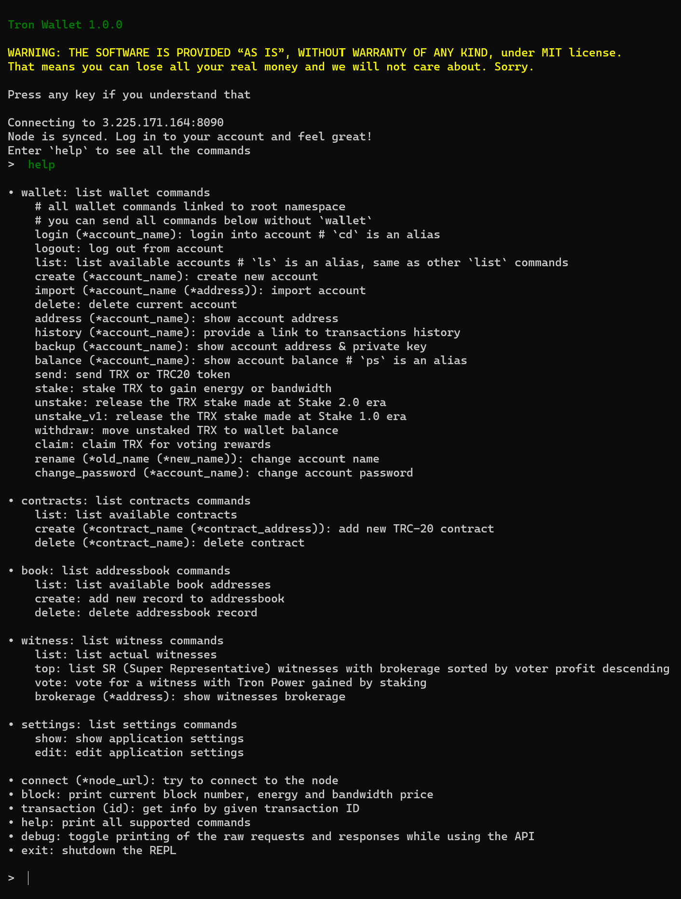

# Tron Wallet

Simple [Tron](https://tron.network/) CLI wallet without backdoors

(trust me, I am very honest)

## IMPORTANT

THE SOFTWARE IS PROVIDED “AS IS”, WITHOUT WARRANTY OF ANY KIND,
under [MIT license](LICENSE.txt).
*This means you can lose all your real money and we will not care about it.
Sorry.*

This wallet is maintained by enthusiasts in their free time.
It can be not up to date with the current Tron API.
Your private key may not work.
Your operations may stuck in the middle.
You can see an incorrect balance in your wallet.
A lot of functions are not implemented.
And there are a lot of errors in the existing ones.

**Use it AT YOUR OWN RISK.**

...still, it is a perfect tool for testing Tron payments
in your projects via testnet.

## Usage

With this wallet, you can connect to any Tron node in mainnet or testnet.

Using various commands you can create or import any number
of key-address pairs (**accounts**). Each account has its own password,
used to encrypt your private key in the local SQLite.
So even with your SQLite file, `wallet.`db`, a marvelous actor cannot access your money.

**It's recommended to backup your `wallet.db` on the external drive
and your passwords in a physical paper notebook. Do it every time you add
a new account to the wallet. If you lose any of those two components,
you will not be able to access your money!**

You can manage TRC20 smart contracts to be able to deal with USDT, USDC, etc.
Arbitrary (non-currency) contracts are not supported.

Staking and voting are supported, but in case of unstake, you will not able
to see your money in this wallet for two weeks at the moment of writing.

There is a simple address book under the `book` command for your convenience.

### Run with Docker

The simplest way to use the wallet is [Docker](https://www.docker.com/products/docker-desktop/):

```bash
docker run --rm -it -v ~:/home xanders/tron-wallet
```

[The image](https://hub.docker.com/repository/docker/xanders/tron-wallet) is extra tiny, **20.9MB**, statically built from scratch.

The `-v ~:/home` part means you will mount your host home directory
into the container, so the wallet database will be stored here.
On Windows `~` does not work, use `%homedrive%%homepath%` instead.

⚠️ **WARNING:** ⚠️ do NOT use Docker volumes to store the wallet database,
because it's too easy to delete the volume occasionally.
And never run the image without `-v` at all. Both cases will lead to
**irreversible loss of your money**.

So:

```bash
docker run --rm -it xanders/tron-wallet # ❌ BAD ❌
docker run --rm -it -v very-secure-volume:/home xanders/tron-wallet # ❌ BAD ❌
docker run --rm -it -v ~:/home xanders/tron-wallet # ✔️ GOOD ✔️
docker run --rm -it -v /my/own/secure/path:/home xanders/tron-wallet # 🔐 BEST 🔐
```

By default, Tron Wallet will create a hidden `.local` folder
in the given path and a `tron-wallet` folder inside to store the `wallet.db`.
You can change this behavior with the environment variables described below.

The only good option to use volumes is while using the testnet.

### Run without Docker

* Install [Crystal Language](https://crystal-lang.org/) `>= 1.8.0`
* Install `libreadline-dev`, `libsqlite3-dev`
* Clone [this repo](https://github.com/Xanders/tron-wallet)
* Run `make shards release install`
* From any directory run `tron-wallet`

### Inside

Print `help` to list available commands:



### Configuration

You can use the following environment variables:

* `TRON_WALLET_DB_DIR`: path to the directory where Tron Wallet will store its database, default: `$HOME/.local/tron-wallet` (`$HOME` is `/home` in the Docker image)
* `TRON_WALLET_DEFAULT_NODE_URL`: Tron node URL to connect to, default: ask on first start ([list of mainnet nodes](https://tronprotocol.github.io/documentation-en/developers/official-public-nodes/), remember to add `:8090` after IP)
* `TRON_WALLET_DEFAULT_MAX_FEE`: maximum allowed fee for transaction in TRX, default: ask on first start
* `TRON_WALLET_PREDEFINED_CONTRACTS`: contracts that should be added to the database at initial startup in the form of `NAME1:address1,NAME2:address2,<...>`, default: none (see [USDT](https://tron.network/usdt), [USDC](https://tron.network/usdc))
* `TRON_WALLET_ONE_INSECURE_PASSWORD`: when set, will be used for all password prompts, **NEVER USE IT ON MAINNET**, default: use own password for every address

*Note:* node URL and maximum commission can be adjusted in runtime
and saved into the database via the `settings` command.

### When developing Tron-related applications

It is a common case to use the wallet connected to testnet
when developing Tron-related applications. For this case,
you can add this Tron Wallet to your `docker-compose.yml`:

```yaml
name: my-cool-project

services:
  tron-wallet:
    image: xanders/tron-wallet
    tty: true # To be able to attach
    stdin_open: true # To be able to attach
    volumes:
      tron-wallet:/home # Use the volumes only for testnet!
    environment:
      TRON_WALLET_DEFAULT_NODE_URL: "https://api.shasta.trongrid.io" # See https://www.trongrid.io/shasta
      TRON_WALLET_DEFAULT_MAX_FEE: "100"
      TRON_WALLET_PREDEFINED_CONTRACTS: "USDT:TQQg4EL8o1BSeKJY4MJ8TB8XK7xufxFBvK" # This is Shasta testnet USDT address, NOT mainnet
      TRON_WALLET_ONE_INSECURE_PASSWORD: "absolutely-insecure" # Please change to another insecure phrase

volumes:
  tron-wallet:
```

And now you can run your wallet in the background and connect at any moment:

```bash
docker compose up tron-wallet -d
docker attach my-cool-project-tron-wallet-1
```

*(hit `enter` after attach to see the output)*

While you *can* mount a folder in your project to store the `wallet.db`,
please *do not do that*. It's too simple for a random developer
to switch to mainnet, add some accounts, and then push to the repo.
This is the case where using volumes is better. Or you can add
the mounted folder to the `.gitignore`, it is safe too.

If you need to have some pre-defined accounts or address book records,
please open an issue, and we can add such functionality.

*Note:* Tron Wallet was **not** designed as Crystal Shard. It does not
have a stable API and relies on user interaction in a lot of places.
If you creating a Tron-related project in Crystal, then — wow — please
open an issue to discuss how we can design an API together.

## Contribute

Well, you know. 🍴 Fork and create the Pull Request.
Or create an issue for a feature request or bug report.
Any help is welcome!

Run `make` to list all the commands available.
Consider using the `debug` wallet command to see API requests and responses.

## TODO

[ ] Refactor source, add with_decrypt block
[x] Show energy and bandwidth in balance
[x] Add stacking TRX
[ ] Add inline swap coins through exchange
[ ] Add autocomplete commands by TAB
[x] Edit wallet names
[ ] Edit contracts, book records
[x] Add link to transactions on TronScan